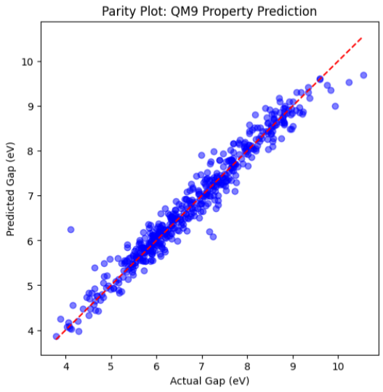
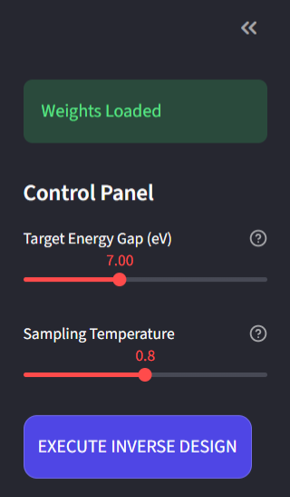
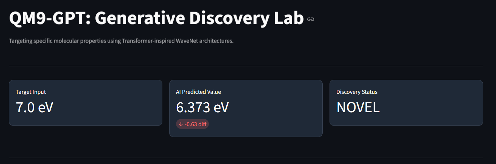
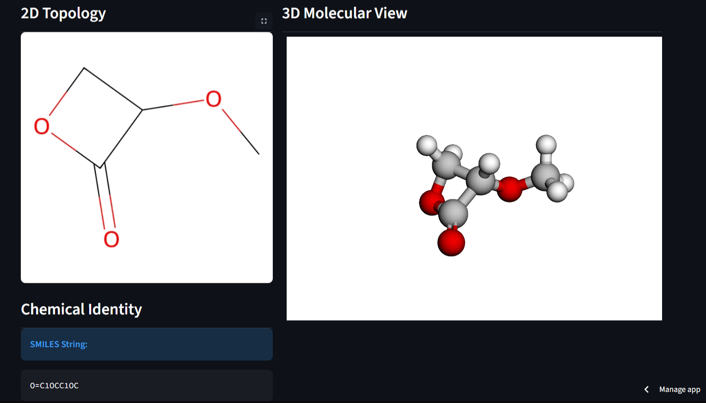

# QM9-GPT: Molecular Inverse Design Lab

##  Project Overview

QM9-GPT is a deep learning platform that performs Inverse Molecular Design process of starting with a desired physical property and generating the chemical structure that satisfies it.

While traditional drug discovery relies on screening existing databases, this project uses a Conditional WaveNet to produce entirely new molecules optimized for specific HOMO-LUMO energy gaps.

---

## How It Works (The "Engine")

The system consists of three interconnected neural components that work in a feedback loop:

### 1. The Language Model (Generator)

* **Architecture**: A WaveNet-style model using  to capture long-range dependencies in SMILES strings.
* **Sampling**: Implements Temperature Scaling () to balance chemical validity () against structural novelty ().

### 2. The Property Predictor (Critic)

* **Task**: Acts as an independent "judge" to verify if the AI's invention actually meets the target energy gap.
* **Accuracy**: Achieves high correlation on the QM9 test set (refer to the Parity Plot below).

### 3. The Discovery Pipeline (Inference)

* **Validity Loop**: Automatically filters out syntactically incorrect SMILES using RDKit.
* **Novelty Check**: Cross-references every generated molecule against the 133,885 structures in the QM9 Dataset to ensure the AI has discovered a brand-new molecule rather than memorizing a known one.

---

## Performance & Results

### Predictor Accuracy

The model shows strong alignment between predicted and actual HOMO-LUMO gaps.

*Caption: Task 2 results showing  performance on unseen molecules.*

### Diversity of Discovery

The AI successfully generates a wide range of chemical scaffolds for a single energy target.

*Caption: 16 novel molecules generated for a 7.0 eV target.*

---

## Repository Structure

* `/app`: The **Streamlit** deployment source code.
* `/data/processed`: Cleaned version of the **QM9 dataset** (133k molecules).
* `/notebooks`: Step-by-step development from Language Modeling to Inverse Design.
* `outputs/`: Trained weights (`.pt` files) for the Generator and Predictor.

---

## Deployment & Installation

The project is live at **[qm9-gpt.streamlit.app](https://qm9-gpt.streamlit.app)**.

To run locally:

1. **Clone**: `git clone https://github.com/anson10/QM9-GPT.git`
2. **Environment**: `pip install -r requirements.txt`
3. **Run**: `streamlit run app/app.py`

---

## Website Preview
### Parameters Section

### Generated Outputs

